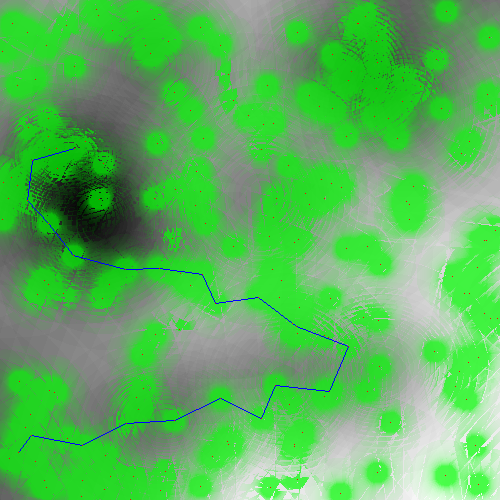
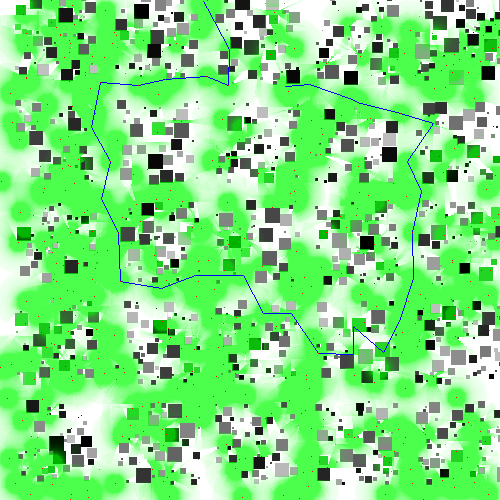
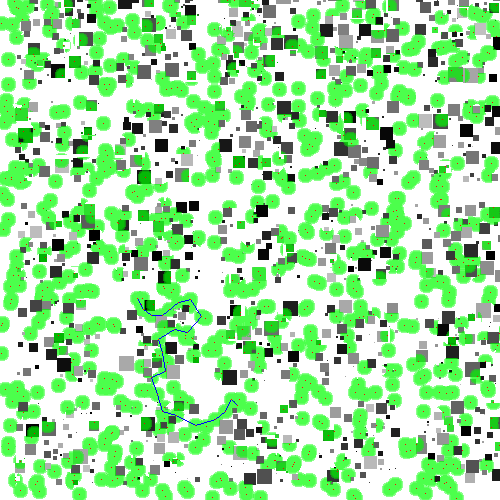
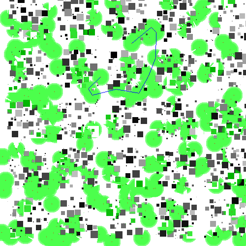
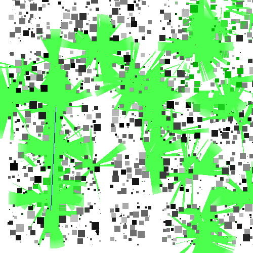
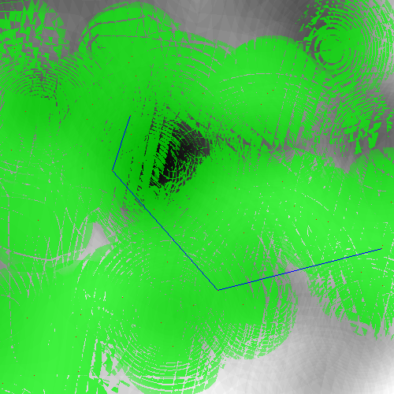
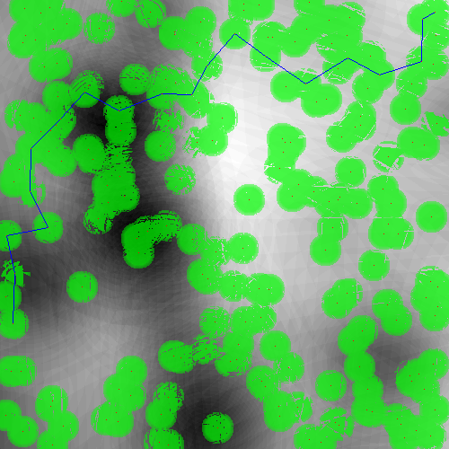

# IDATT2104-Wireless-Mesh

# Table of contents

- [Overview](#overview)
- [Installation Instructions](#installation-instructions)
   - [Software Requirements](#software-requirements)
   - [Steps to Compile and Run the Software](#steps-to-compile-and-run-the-software)
- [Instructions for using the program](#instructions-for-using-the-program)
   - [Tips for using the program](#tips-for-using-the-program)
- [Elevation Generation](#elevation-generation)
   - [Function Details](#function-details)
   - [Mountain Elevation Generation](#mountain-elevation-generation)
   - [City Elevation Generation](#city-elevation-generation)
   - [Visualization](#visualization)
      - [Grayscale Mapping](#grayscale-mapping)
      - [Drawing Connection Lines](#drawing-connection-lines)
      - [Drone Position](#drone-position)
      - [Drone Signal Influence](#drone-signal-influence)
      - [Writing Bitmap Images](#writing-bitmap-images)
      - [Console Rendering](#console-rendering)
- [DSDV Routing Algorithm (Destination-Sequenced Distance Vector)](#dsdv-routing-algorithm-destination-sequenced-distance-vector)
   - [Routing Table](#routing-table)
   - [Routing Table Updates](#routing-table-updates)
   - [Sequence number](#sequence-number)
- [Further Work](#further-work)
   - [DSDV](#dsdv)
   - [Console](#console)
   - [Visualization](#visualization-1)
- [Example images](#example-images)
   - [City](#city)
   - [Mountain](#mountain)

# Overview
This is a simulation using the DSDV (Destination-Sequenced Distance Vector) routing algorithm to determine a good path 
for routing messages in a mesh network. The program is designed to simulate the behavior of a wireless mesh network with
a configurable number of nodes, signal strength, and with different map configurations.

Program created by:
* Eilert W. Hansen
* Brage H. Kvamme

# Installation Instructions
this project contains software for a wireless mesh network.
There are two executable files provided for your convenience:
one for Windows users and another for macOS and Linux users.

## Software Requirements

- GCC Compiler (version 7.0 or above)
- Make
- A C++17 compatible system

## Steps to Compile and Run the Software

**If you want to use the provided executable files, skip to step 4.**

1. #### Download or clone the project repository to your local machine.
2. #### Navigate to the project directory.

    For MacOS/Linux users:
    
        cd path_to_your_directory/Wireless-Mesh/
    
    For Windows users:
    
        cd path_to_your_directory\Wireless-Mesh\

3. #### Use the provided makefile to compile the project.

    For MacOS/Linux users:
    
        make
    
    For Windows users:
    First, make sure you have installed MinGW or any software that provides a Make environment for Windows.
    
        mingw32-make
    
    If the make command does not work, you can compile the project manually using the following command:
    
        g++ -std=c++17 -pthread -o Mesh main.cpp node/Node.cpp worker/Workers.cpp topography/Topography.cpp
    

4. #### Run the executable file.

    For MacOS/Linux users:
    
        ./mesh
    
    For Windows users:
    
        mesh.exe

# Instructions for using the program
When the program is run, you will be prompted to choose the terrain. You can choose between a city or a mountain 
with different sizes. 

After choosing the terrain, you will be prompted to choose the number of nodes in the network and the signal
strength of the nodes. You can either choose custom numbers, or choose preset values.

After choosing the number of nodes and signal strength, the simulation is started. In the CLI, you will
be able to use a set of commands. These commands are listed below.

- `help` - Shows a list of commands
- `exit` - Exits the program
- `print` - Print the routing tables of all nodes
- `nodeInfo` - Print information about a node
- `change` - Change the position of a node
- `create` - Create a new node
- `send` - Send a message from a node to another node. Also generates an image that shows the path chosen
- `save` - Save the topography to a file. This file can later be loaded using the `load` option when the choosing terrain

## Tips for using the program

- When choosing the number of nodes and signal strength, it is recommended to choose numbers that are not too high, as the program will become very slow.
- Sending messages may be a bit clunky, as you don't know what nodes are connected. It is recommended to first use the `print` command to see the routing tables of all nodes, and then use the `send` command to send a message between two nodes that are connected.

# Elevation Generation

The `Topography` class offers two methods to generate elevation maps, `generateMountainElevation` and
`generateCityElevation`. Both methods produce a 2D matrix representing an area's height in each grid cell.

## Function Details

-`interpolate`: It performs bilinear interpolation based on the four corners of a square grid cell. 
It's used to interpolate elevation at a given point based on nearby grid cells.

-`euclidean`: This function calculates the Euclidean distance between two points,
with a skew factor for more diversity in elevation and terrain generation.

-`gaussian`: It's used to create a Gaussian distribution,
which helps shape the peaks of mountains and hills in the elevation map.

## Mountain Elevation Generation

`generateMountainElevation` method generates an elevation map designed to mimic the natural terrain found
in mountainous regions. It makes use of Perlin noise, a type of gradient noise often used in procedural
texture and terrain generation.

The function operates on the following principles:

- First, it creates an empty elevation data matrix filled with zeros.

- Next, it generates a series of Perlin noise maps. Each layer is generated with a different frequency and amplitude,
which then contribute to the final noise.
    
- The method uses a random skew factor to adjust the influence of each noise layer.
    
- Once all the noise layers have been generated, they are summed to create the final elevation map.
    
- Peaks are generated at random positions with a Gaussian function affecting their shape.

Here is an example of a mountain elevation map:

## City Elevation Generation

`generateCityElevation` method generates an elevation map representing a cityscape.
The map includes roads and buildings, each with varying heights.

The method operates on these key steps:

- It first creates an empty elevation data matrix filled with zeros.
- Then it generates a grid of roads across the city. The road width and spacing between roads are adjustable parameters.
- Buildings are placed on the grid randomly. Their heights and sizes are also randomly generated,
and the method ensures that buildings do not overlap with one another or with the roads.
- The function has a limit to the number of attempts to place a building to prevent an infinite
loop if the parameters do not allow for the requested number of buildings.

Please note that both functions rely on the user providing a reasonable range of elevations and other parameters.
For realistic results, consider the scale and nature of the terrain or city you're trying to model.

Here is an example of a city elevation map:

## Visualization

This project provides both console and bitmap image visualization for the drone network. Each drone node,
connection line between nodes, and the influence of drone signals are rendered with distinct colors.
How it works

### Grayscale Mapping

The `getGrayscale(int elevation, int minElevation, int maxElevation)` function is used to generate a grayscale
value for a given elevation. This allows us to visualize elevation data on the map in shades of gray. The
function scales the elevation between the minimum and maximum elevations to a grayscale value between 0 and 255.

### Drawing Connection Lines

The `drawLine(Node* nodeA, Node* nodeB)` function uses a basic line-drawing algorithm (Bresenham's line algorithm)
to determine the set of points that represent a straight line between two nodes (drones). This is used to visualize
the connections between drones.

### Drone Position

The `isDronePosition(const std::vector<Node*>& nodes, int x, int y)` function checks if a given point (x, y)
corresponds to the position of any drone in the network.

### Drone Signal Influence

The `getTotalDroneInfluence(const std::vector<Node*>& nodes, int x, int y)` function calculates the total
influence of all drones at a particular point (x, y). The influence is calculated based on the distance
between the point and each drone, and the signal power of each drone.

### Writing Bitmap Images

Bitmap images are created using the `writeMapToBMP(...)` function. This function writes BMP headers,
then goes through each point in the topography, checking if the point corresponds to a drone position,
a line between drones, or an area influenced by a drone's signal. It writes the corresponding pixel data for each case.

### Console Rendering

The `printMapToConsole(...)` function is used to render the map to the console.
It uses ASCII characters to represent the drones, lines between drones, and the influence of drone signals.

In both types of visualization, drones are represented with blue color,
lines between drones are represented with red color,
and the areas influenced by drone signals are represented in a gradient color where darker
color indicates a stronger signal. The elevation is represented with grayscale colors where
darker color indicates a higher elevation.
   
# DSDV Routing Algorithm (Destination-Sequenced Distance Vector)

DSDV is a routing protocol where each node has a routing table with every destination reachable and the number of hops 
to reach them. The entries in the tables are has a sequence number. Each node in the network periodically broadcasts an 
update to all other nodes in range. The nodes update their routing tables based on new information received.

The routing algorithm has improvements to be made and is not a complete solution. 
The following chapters will explain the routing algorithm and how it is implemented in this application.

## Routing Table
A row in the routing table contains 4 values:
* Destination: Where a message can go
* Next hop: What node the message needs to go to next to get to the destination
* Number of hops: Number of hops to get to destination
* Sequence number: A higher sequence number means that the row in newer. Used to determine if a row is outdated

## Routing Table Updates
When the simulation is running, tables are updated every 5 seconds. This makes sure the tables stay updated if the nodes
move around. However, updating the routing tables in DSDV should be both event-driven and time-driven. This 
implementation does not include event-driven updates. When a significant change in the routing tables has occurred, the 
table should be broadcast, but that is a feature that is not implemented yet.

## Sequence number
This number is stored in the routing table. Every time a row is updated, the sequence number should increase by two.
When a node is not in range anymore, the sequence number should increase by one and the distance (number of hops)
should be set to infinite. This is to make sure that there are no
endless update loops in the network. You can read more about infinite update loops 
[here](https://en.wikipedia.org/wiki/Routing_loop). 

In this program, the sequence number is increased by two every time a routing table is broadcast. This is not the
correct way to do it, but it is a simple way to make sure that the sequence number is always higher than the previous.

# Further Work

## DSDV
The DSDV routing algorithm is not complete. The following features should be implemented:
* Event-driven updates
* Better sequence number handling
* Better handling of nodes going out of range
* The sequence number should be increased by one when a node is out of range.

## Console
The console used to control the application could add some features:
* Better error handling
* Better input handling
* More detailed help menu
* More commands. Here are some examples:
  * Move every node randomly
  * Move every node a little bit
  * Other movement options to simulate a custom scenario

## Visualization
The visualization of the network could be improved:
* The signal radius does match the actual radius on smaller signal strength
* More information on the screen
* More detailed information about the network
* The console visualisation could blend radius colors with the level colors

# Example images

## City

## Mountain

